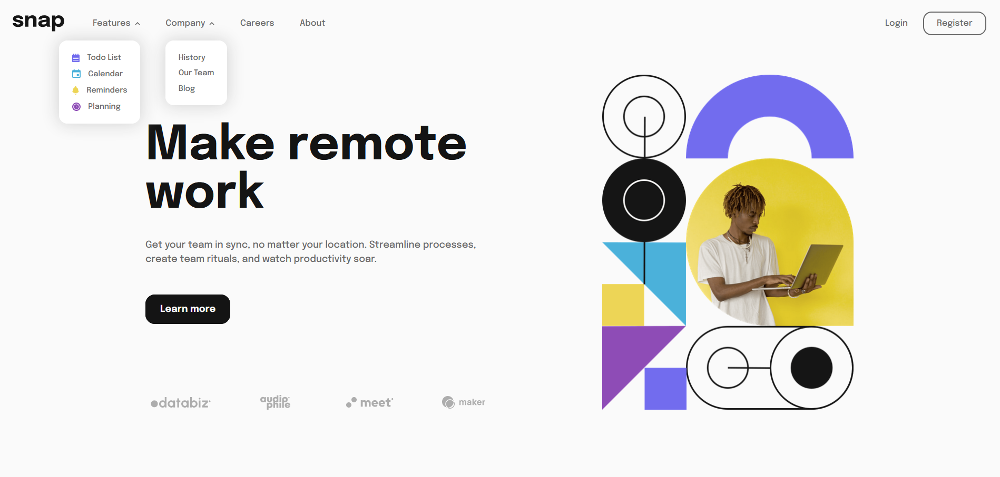
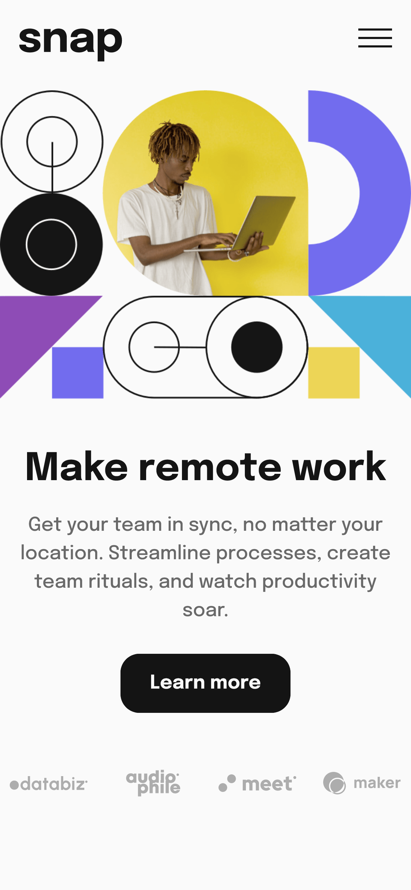

# Frontend Mentor - Intro section with dropdown navigation solution

This is a solution to the [Intro section with dropdown navigation challenge on Frontend Mentor](https://www.frontendmentor.io/challenges/intro-section-with-dropdown-navigation-ryaPetHE5). Frontend Mentor challenges help you improve your coding skills by building realistic projects.

## Table of contents

- [Overview](#overview)
  - [The challenge](#the-challenge)
  - [Screenshot](#screenshot)
  - [Links](#links)
- [My process](#my-process)
  - [Built with](#built-with)
  - [What I learned](#what-i-learned)
  - [Continued development](#continued-development)

## Overview

### The challenge

Users should be able to:

- View the relevant dropdown menus on desktop and mobile when interacting with the navigation links
- View the optimal layout for the content depending on their device's screen size
- See hover states for all interactive elements on the page

### Screenshot

<!--  -->

### Links

- Solution URL: [GitHub](https://github.com/junwei-tj/intro-section-with-dropdown-navigation-frontend-mentor)
- Live Site URL: [GitHub Pages](https://junwei-tj.github.io/intro-section-with-dropdown-navigation-frontend-mentor/)

## My process

### Built with

- HTML
- CSS
- Flexbox
- Mobile-first workflow
- Javascript

### What I learned

This project took slightly longer than 2 weeks, with on-and-off-again efforts. This project could definitely be finished within a week had I been able to pay more focus to it (the code could've been better too).

I decided to try a mobile-first approach in hopes that it would make accounting for media responsiveness easier; in some ways, it did. However, I still struggled with accounting for desktop screens, and had to go back to edit the mobile version such that it would make developing for desktop screens easier (looking at you footer bar). In addition, I definitely added some "hacky" solutions, such as having two different elements for the main image (ideally, I would have tried to use CSS only).

Learning points:

- Working with images is definitely not fun as I faced issues with avoiding the use of pixels for sizing images. This led to the many times the images were bigger than the container they were in (or having improper aspect ratios). However, I think I managed to find a good solution, which is to enclose images with a div (with a specified width in percentages). Then, set the image to `max-width: 100%; max-height: 100%`. It remains to be seen if this solution is applicable to every scenario, though.
- I decided to avoid using CSS frameworks like Bootstrap in hopes for developing my CSS skills. That said, I gained a better appreciation for Bootstrap after this project, as there were many of their classes I could've used (e.g. `col`, `container`, etc)
- Plan, plan, and plan! A mobile-first approach is not enough to deal with responsiveness; I should've planned how I want each component in the mobile design to change with larger screens. For example, I initially had the footer be separated from the `content` container. But I realise in the desktop version, I needed the footer to be part of the `content` container. Had I planned this in the first place, it would've made coding for desktop screens easier.

### Continued development

Definitely, mobile responsiveness is still a priority of mine. That said, I realised there were some components that I've taken from granted from CSS libraries, such as simple dropdown menus or a sliding menu. Having to design them myself and getting them to work is harder than I had initially imagined. I hope to use a pure CSS approach for such components in the future.

## Author

- Frontend Mentor - [@junwei-tj](https://www.frontendmentor.io/profile/junwei-tj)
